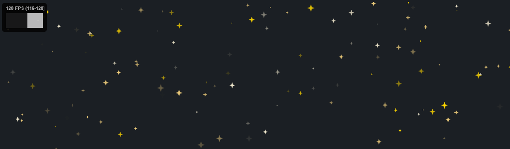

# Sparticles
### javascript particles in canvas

#### https://sparticlesjs.dev

**Lightweight, _High Performance_ Particles in Canvas.**  
<sup>For those occasions when you ***👏 just 👏 gotta 👏 have 👏*** sparkles, 
snow, or stars on your homepage!</sup>  




---

- [installation](#installation)
- [framework usage (Svelte 5, React, Vue)](#framework-usage-svelte-5-react-vue)
- [parameters](#parameters)
- [options](#options)
- [methods](#methods)
- [styling](#styling)
  - [placing in the page's background](#placing-the-sparticles-in-the-page-s-background)
  - [fading out at the edges](#fading-particles-at-the-edges-radial-gradient-mask)
- [performance](#performance)
- [why?](#why-sparticles-)

---
  

# installation

Depending on how your project looks, 
- you may want to [include a direct link to the script](#vanilla) and 
then initialise the sparkles,
- or you may want
to [import the module in to your application](#app--bundler) for a more modern approach.

## vanilla

1. firstly make sure you've downloaded [the latest version of the script](https://github.com/simeydotme/sparticles/releases) 
to your application directory _(if you are running on a CMS you might also 
need to upload the file to your server)_. The file you'll want to use is; `dist/sparticles.min.js` 
to make sure it downloads the fastest for your users.

2. After you've downloaded, or uploaded, the `sparticles.min.js` file to the 
correct place, you'll then need to include it in your web page;

```html
<script src="../path/to/sparticles.min.js"></script>
```

3. And finally, you should then be able to initialise the Sparticles by 
running this code in your javascript;  
<sup>_(make sure this code runs _after_ you've included the script above.)_</sup>

```html
<script>
  window.onload = function() {
    let myElement = document.getElementById("myDiv");
    let mySparticles = new Sparticles(myElement, { count: 100 }, 400);
  }
</script>
```

## jquery

For jQuery sites, you may follow all of the steps above, but replace 
the third step with something like below;

```html
<script>
  let $el = $("#myDiv");
  let mySparticles = new Sparticles($el[0], { count: 100 }, 400);
</script>
```

## app / bundler

If you're running a more modern type of application with something like Svelte or VueJs; 

1. First you will want to install the module with NPM;

```bash
yarn add --dev sparticles
# or npm, if you prefer
npm install --save-dev sparticles
```

2. Then import the module in to the app where you want to use it

```js
import Sparticles from "sparticles";
```

3. Attach Sparticles to a DOM node when it's available (see [Framework usage](#framework-usage-svelte-5-react-vue) for Svelte 5, React, and Vue patterns):

```js
new Sparticles(node, { count: 100 }, 400);
```

# framework usage (Svelte 5, React, Vue)

Use a **ref** to the container element, create the Sparticles instance when the ref is mounted, and **destroy** it on cleanup so the canvas is removed and listeners are freed.

## Svelte 5

Bind to the container with `bind:this`, create Sparticles in `onMount`, and destroy in `onDestroy`:

```html
<script>
  import { onMount, onDestroy } from "svelte";
  import Sparticles from "sparticles";

  let container;
  let sparticles;

  onMount(() => {
    if (container) {
      sparticles = new Sparticles(container, { count: 100, color: "gold" });
    }
  });

  onDestroy(() => {
    if (sparticles) {
      sparticles.destroy();
    }
  });
</script>

<div bind:this={container} class="sparticles-wrap"></div>
```

Or use an **action** so init and cleanup stay in one place:

```html
<script>
  import Sparticles from "sparticles";

  function sparticles(node, options = {}) {
    const instance = new Sparticles(node, options);
    return {
      destroy() {
        instance.destroy();
      },
    };
  }
</script>

<div use:sparticles={{ count: 100, color: "gold" }} class="sparticles-wrap"></div>
```

## React

Use a **ref** for the container and **useEffect** to create on mount and destroy on unmount:

```jsx
import { useRef, useEffect } from "react";
import Sparticles from "sparticles";

export function ParticleBackground() {
  const containerRef = useRef(null);

  useEffect(() => {
    if (!containerRef.current) return;
    const instance = new Sparticles(containerRef.current, { count: 100 });
    return () => instance.destroy();
  }, []);

  return <div ref={containerRef} className="sparticles-wrap" />;
}
```

If you need to react to option changes, depend on them in the effect and destroy/create on change:

```jsx
useEffect(() => {
  if (!containerRef.current) return;
  const instance = new Sparticles(containerRef.current, options);
  return () => instance.destroy();
}, [options.count, options.speed /* etc. */]);
```

## Vue 3

Use a **ref** for the container, create Sparticles in **onMounted**, and destroy in **onUnmounted**:

```vue
<script setup>
import { ref, onMounted, onUnmounted } from "vue";
import Sparticles from "sparticles";

const container = ref(null);
let instance = null;

onMounted(() => {
  if (container.value) {
    instance = new Sparticles(container.value, { count: 100 });
  }
});

onUnmounted(() => {
  if (instance) {
    instance.destroy();
  }
});
</script>

<template>
  <div ref="container" class="sparticles-wrap"></div>
</template>
```

With **Options API**, use a container ref and `mounted` / `beforeUnmount`:

```vue
<script>
import Sparticles from "sparticles";

export default {
  data() {
    return { instance: null };
  },
  mounted() {
    if (this.$refs.container) {
      this.instance = new Sparticles(this.$refs.container, { count: 100 });
    }
  },
  beforeUnmount() {
    if (this.instance) this.instance.destroy();
  },
};
</script>

<template>
  <div ref="container" class="sparticles-wrap"></div>
</template>
```

---

# usage

Providing that the script/module has been properly included, then it can be initialised
by running the `Sparticles()` constructor;
```js
let mySparticles = new Sparticles();
```

# parameters

When initialising the Sparticles instance there are some parameters that can be supplied.

| parameter               | type          | default            | description                                                 |
| ----------------------- | ------------- | ------------------ | ----------------------------------------------------------- |
| **node**                | `HTMLElement` | `document.body`    | the element in the DOM which the Sparticles will append to  |
| **[options](#options)** | `Object`      | `{}`               | an object with [all the options for the instance](#options) |
| **width**               | `Number`      | `node.clientWidth` | the width of the canvas element                             |
| **height**              | `Number`      | `node.clientWidth` | the height of the canvas element (defaults to width)        |

<sup>Leave the `width`/`height` properties empty to make the canvas resize to fit it's `node`</sup>

---

- Supply nothing and get a default Sparticle instance on the `<body>`
```js
let mySparticles = new Sparticles();
```

- Supply a single HTMLElement parameter for a default Sparticle instance on that element
```js
let mySparticles = new Sparticles(document.getElementById("myDiv"));
```

- Supply a single `Object` parameter to customise a Sparticle instance on the `<body>`
```js
let mySparticles = new Sparticles({ color: "red" });
```

- Supply the width and height parameters for a custom size
```js
let mySparticles = new Sparticles({ color: "red" }, 400, 300);
```

# options

A brief look at all the options, with more details below.

| option                                    | type             | default       | description                                                                                  |
| ----------------------------------------- | ---------------- | ------------- | -------------------------------------------------------------------------------------------- |
| **[composition](#composition)**           | `String`         | `source-over` | canvas `globalCompositeOperation` value for particles                                          |
| **[count](#count)**                       | `Number`         | `50`          | number of particles on the canvas simultaneously                                             |
| **[speed](#speed)**                       | `Number`         | `10`          | default velocity of every particle                                                           |
| **[parallax](#parallax)**                 | `Number`         | `0`           | strength of size-based speed variation 0–100 (0 = off; smaller slower, larger faster)        |
| **[direction](#direction)**               | `Number`         | `180`         | default direction in degrees (0 = ↑, 180 = ↓); ignored when `spawnFromCenter` is true          |
| **[xVariance](#xVariance)**               | `Number`         | `2`           | random deviation of particles on x-axis from default direction                               |
| **[yVariance](#yVariance)**               | `Number`         | `2`           | random deviation of particles on y-axis from default direction                               |
| **[rotate](#rotate)**                     | `Boolean`        | `true`        | can particles rotate                                                                         |
| **[rotation](#rotation)**                 | `Number`         | `1`           | default rotational speed for every particle                                                  |
| **[alphaSpeed](#alphaSpeed)**             | `Number`         | `10`          | rate of change in alpha over time                                                            |
| **[alphaVariance](#alphaVariance)**       | `Number`         | `1`           | random deviation of alpha change                                                             |
| **[minAlpha](#minAlpha)**                 | `Number`         | `0`           | minumum alpha value of every particle                                                        |
| **[maxAlpha](#maxAlpha)**                 | `Number`         | `1`           | maximum alpha value of every particle                                                        |
| **[minSize](#minSize)**                   | `Number`         | `1`           | minimum size of every particle                                                               |
| **[maxSize](#maxSize)**                   | `Number`         | `10`          | maximum size of every particle                                                               |
| **[bounce](#bounce)**                     | `Boolean`        | `false`       | should the particles bounce off edge of canvas                                               |
| **[drift](#drift)**                       | `Number`         | `1`           | the "driftiness" of particles which have a horizontal/vertical direction                     |
| **[glow](#glow)**                         | `Number`         | `0`           | the glow effect size of each particle                                                        |
| **[twinkle](#twinkle)**                   | `Boolean`        | `false`       | particles to exhibit an alternative alpha transition as "twinkling"                          |
| **[style](#style)**                       | `String`         | `fill`        | fill style of particles (one of; `fill`, `stroke` or `both`)                                 |
| **[shape](#shape)**                       | `String`/`Array` | `circle`      | shape of particles (any of; circle, square, triangle, diamond, line, image) or "random"      |
| **[color](#color)**                       | `String`/`Array` | `random`      | css color as string, or array of color strings (can also be `random`)                        |
| **[randomColor](#randomColor)**           | `Function`       | `randomHsl()` | function for returning a random color when the color is set as `random`                      |
| **[randomColorCount](#randomColorCount)** | `Number`         | `3`           | number of random colours when the color is set as `random`                                   |
| **[spawnFromCenter](#spawnFromCenter)**   | `Boolean`        | `false`       | when `true`, particles spawn in a circle at center and move radially outward                   |
| **[spawnArea](#spawnArea)**               | `Number`         | `20`          | spawn circle diameter as % of canvas width (0–90) when `spawnFromCenter` is true               |
| **[staggerSpawn](#staggerSpawn)**         | `Number`         | `0`           | when `> 0` and `spawnFromCenter`, staggers initial spawns over this many seconds        |
| **[imageUrl](#imageUrl)**                 | `String`/`Array` |               | if shape is `image`, define an image url (can be data-uri, **should be square (1:1 ratio)**) |

---

## `composition`
- Type: `String` 
- Default: `source-over`
- Possible: [`see list here`](https://developer.mozilla.org/en-US/docs/Web/API/CanvasRenderingContext2D/globalCompositeOperation)

The [global render composition](https://developer.mozilla.org/en-US/docs/Web/API/CanvasRenderingContext2D/globalCompositeOperation)
when rendering particles on top of one-another. This, however, is a very expensive operation when set to anything
other than the default value (`source-over`), and will ultimately degrade performance, especially with many particles.

Will accept [any of the values that are provided as part of the Canvas API](https://developer.mozilla.org/en-US/docs/Web/API/CanvasRenderingContext2D/globalCompositeOperation)

## `count`
- Type: `Number`
- Default: `50`
- Range: `1 - 10000`

Simply the number of particles drawn to the screen.  
Values over `500` may begin to degrade performance.

## `speed`
- Type: `Number`
- Default: `10`
- Range: `0 - 100`

The base value of speed across all particles. This is modified by options such as 
`parallax` and `[x/y]Variance` to determine the final velocity of each individual particle.
A speed of `0` will render particles stationary before applying `[x/y]Variance`.

## `parallax`
- Type: `Number`
- Default: `0`
- Range: `0 - 100`

Strength of size-based speed variation. When `0`, parallax is off and all particles use the base speed. When set, particles smaller than the median size (between `minSize` and `maxSize`) move slower, and larger particles move faster, simulating near/far depth. The average speed stays stable when you change parallax, so the `speed` option remains the main control. Values around 50 give a moderate effect; 100 gives strong variation (e.g. double size ≈ double speed).

## `direction`
- Type: `Number`
- Default: `180`
- Range: `0 - 360`

The base angle (in degrees) at which the particles are travelling, so long as they have a speed value. Ignored when [spawnFromCenter](#spawnFromCenter) is true.

## `xVariance`
- Type: `Number`
- Default: `2`
- Range: `0 - 20`

How much variance is applied between particles on the `X` axis. A value of `0` will make all particles
appear to be going completely parallel, and look unnatural.

Can be used in conjunction with `speed: 0;` to make particles which float randomly in space.

## `yVariance`
- Type: `Number`
- Default: `2`
- Range: `0 - 20`

How much variance is applied between particles on the `Y` axis. A value of `0` will make all particles
appear to be going completely parallel, and look unnatural.

Can be used in conjunction with `speed: 0;` to make particles which float randomly in space.

## `rotate`
- Type: `Boolean`
- Default: `true`

Toggle whether the particles are allowed to spin about their axis.

## `rotation`
- Type: `Number`
- Default: `1`
- Range: `0 - 20`

How fast the particles can spin about their axis, this has a random multiplier added per-particle
which prevents a completely unnatural spinning effect.

## `alphaSpeed`
- Type: `Number`
- Default: `10`
- Range: `0 - 50`

Rate of change for the alpha value of all particles. A higher value will encourage the particles
to flicker like candle lights. A value of `0` will disable alpha change.

## `alphaVariance`
- Type: `Number`
- Default: `2`
- Range: `0 - 10`

How much variance is applied between each particle on the alpha value change over time. A value
of `0` will cause all particles to change alpha at the same rate, a higher value will introduce more
variety.

## `minAlpha`
- Type: `Number`
- Default: `0`
- Range: `-5 - +1`

The minimum alpha value a particle can change to. The lower the number the longer it will stay invisible
on the canvas, this could be useful in some scenarios where the particle should fade out for a while.

Must be lower than the `maxAlpha` value.

## `maxAlpha`
- Type: `Number`
- Default: `0`
- Range: `0 - +5`

The maximum alpha value a particle can change to. The higher the number the longer it will stay visible
on the canvas, this could be useful in some scenarios where the particle should stay at max alpha for a time.

Must be higher than the `minAlpha` value.

## `minSize`
- Type: `Number`
- Default: `1`
- Range: `1 - 100`

Minimum size (in pixels) of the particles. The actual size of each particle is variable between the `minSize`
and `maxSize`. If the `minSize` and `maxSize` are the same value; then all particles will be uniformly sized.

## `maxSize`
- Type: `Number`
- Default: `10`
- Range: `1 - 100`

Maximum size (in pixels) of the particles. The actual size of each particle is variable between the `minSize`
and `maxSize`. If the `minSize` and `maxSize` are the same value; then all particles will be uniformly sized.

## `style`
- Type: `String`
- Default: `"fill"`
- Values: `"fill"`, `"stroke"` or `"both"`

Particles can be either stroked (outline) or filled (solid) and this setting determines that style. It's
also possible to randomize the style by choosing `"both"`

## `bounce`
- Type: `Boolean`
- Default: `false`

Determine if particles should bounce off the boundaries of the canvas instead of resetting to the opposite side.
This is best used with `speed: 0;` and a high value for `[x/yVariance]` to create a chaotic effect.

## `drift`
- Type: `Number`
- Default: `1`
- Range: `1 - 20`

How much a particle will "drift" as it falls. This is to imply a floatiness/wind effect like seen with snow flakes,
or leaves. The `drift` will only apply if `speed > 0` and `direction` is near to a 90degree value (`0, 90, 180, 270`). When [spawnFromCenter](#spawnFromCenter) is true, drift is applied perpendicular to each particle’s radial direction (side-to-side in the particle’s own frame).

## `spawnFromCenter`
- Type: `Boolean`
- Default: `false`

When `true`, particles spawn at a random position inside a circle at the center of the canvas and move **radially outward**. The global [direction](#direction) option is ignored; each particle’s direction is set by its spawn position. Other options (speed, parallax, variance, rotation, drift, bounce, etc.) still apply. Drift is applied perpendicular to the direction of travel. Particles start at 0 opacity and fade in to their initial alpha as they move away, using each particle’s alpha delta for the fade-in rate.

## `spawnArea`
- Type: `Number`
- Default: `20`
- Range: `0 - 90` (percentage of canvas width)

Size of the spawn circle as a **percentage of the canvas width** when [spawnFromCenter](#spawnFromCenter) is true. Values are clamped between 0 and 90. For example, `20` means the circle’s diameter is 20% of the canvas width. New particles (and respawned particles that have gone off-canvas) appear at a random point inside this circle.

## `staggerSpawn`
- Type: `Number`
- Default: `0`
- Range: `0 - …` (seconds)

When greater than 0 (and [spawnFromCenter](#spawnFromCenter) is true), the initial particles are **linearly staggered** over this many seconds instead of all appearing at once. For a given `count`, each particle gets a spawn time evenly distributed between `0` and `staggerSpawn`, and will begin moving/fading in only after its own time has passed. Resets after going off-canvas are not staggered; they respawn immediately.

## `glow`
- Type: `Number`
- Default: `0`
- Range: `0 - 50`

Glow (or shadow) effect around the particle. This will not affect images.

## `twinkle`
- Type: `Boolean`
- Default: `false`

Apply a "twinkle" effect to the particle when changing alpha. This works best with a higher `alphaSpeed` and 
`alphaVariance` value.

## `color`
- Type: `String` / `Array<String>`
- Default: `"random"`
- Values: any valid css/html color string

A CSS/HTML color string to apply across all particles.  
If an array of colors (`[ "#ff0", "red", "hsl(10,50%,50%)" ]`) is given, then each particle will 
be assigned a random color from the array. Additionally `"random"` can be used to assign any random color.

## `randomColor`
- Type: `Function`
- Default: [`randomHSL()`](https://github.com/simeydotme/sparticles/blob/master/src/helpers.js#L55-L64)
- Arguments: `index`, `total`

Custom function to use when generating `random` colors. The default function will return a fairly
pleasant `hsl()` color with a high saturation and medium lightness. This can be overridden to suit
your environment better. The two arguments (`index`, `total`) are `Integer`s and allow for a little
psuedo-randomizing.

**example:**

```js
randomColor: function( index, total ) {
	return `hsl( ${index}, 80%, ${total - index}% )`;
}
```

## `randomColorCount`
- Type: `Number`
- Default: `3`
- Range: `1 - 50`

How many random colors to generate when `color` is `random`. The more colors generated
the more chance there is of a performance penalty. It should be OK up to `50`.

## `shape`
- Type: `String` / `Array<String>`
- Default: `"circle"`
- Values: `"circle"`, `"square"`, `"triangle"`, `"line"`, `"diamond"`, `"star"` or `"image"`

Determine the shape of all the particles.  
If an array of shapes (`[ "circle", "star", "diamond" ]`) is given, then each particle will
be assigned a random shape form the array. Additionally `"image"` can be used to [define a custom
particle shape from an image when combined with `imageUrl`](#imageUrl).

## `imageUrl`
- Type: `String` / `Array<String>`
- Default: `""`
- Values: a valid url, or data-uri

Determine the custom image to be used for all the particles.
If an array of urls (`[ "http://my.image/shape.png", "http://my.svg/shape.svg" ]`) is given, then each particle
will be assigned a random image as it's shape from the array.
<sup>**This image should be a square (1:1)**</sup>  

- ℹ `imageUrl` only has an effect [if a `shape` in the array is; `"image"`](#shape).
- ℹ `imageUrl` can accept **svg**, but the `<svg>` root needs a width/height. [(see issue)](https://github.com/simeydotme/sparticles/issues/2);

# methods

a few public methods can be accessed by storing a reference to the Sparticles instance
and executed like so;

```js
let mySparticles = new Sparticles();
mySparticles.destroy();
```

| method                                               | description                                                |
| ---------------------------------------------------- | ---------------------------------------------------------- |
| **[destroy()](#destroy)**                            | destroy the Sparticles instance and remove event listeners |
| **[setCanvasSize( width, height )](#setCanvasSize)** | set the new size of the canvas                             |
| **[resetSparticles()](#resetSparticles)**            | reset all the particles on the canvas                      |

# styling

If the Sparticles are simply going to be placed in a container (like a `<div>`) then the only
styling that should be necessary is to set the width/height of the canvas [using the 
`width` and `height` parameters](#parameters).

---

## placing the Sparticles in the page's background

To place the Sparticles in the background of a web-page, you'll need to add a
container to the `<body>` which the canvas can sit in, then `position` it `fixed`:

```html
<html>
  <body>
    <!-- your html web page content -->
    <div class="sparticles-container"></div>
  </body>
</html>
```

Then we set up the CSS styling for the Sparticles container depending on our
situation:
```css
.sparticles-container {
  position: fixed;
  left: 0; right: 0;
  top: 0; bottom: 0;

  /** use z-index to position either above or behind the body content */
  z-index: 2;
  /** use pointer-events: none; to prevent the particles from blocking user interaction */
  pointer-events: none;
}
```

Finally we can initiate the Sparticles with the `.sparticles-container`
as the DOM element it's bound to:
```js
let container = document.querySelector(".sparticles-container");
let mySparticles = new Sparticles( container, { color: "red" });
// no need for width/height as the  canvas will fill 
// the container which is fixed to the viewport size
```

## fading particles at the edges (radial gradient mask)

To make particles fade toward the edge of the canvas instead of clipping sharply, you can
apply a **radial gradient mask** to the Sparticles container. The mask makes the center
opaque and the edges transparent, so particles appear to soften and disappear as they
approach the border.

Add `mask-image` (and `-webkit-mask-image` for Safari) to the same container you use for
the canvas:

```css
.sparticles-container {
  /* Fade particles at the edges; center stays fully visible */
  mask-image: radial-gradient(
    farthest-side,
    black 50%,
    transparent 100%
  );
  mask-mode: alpha;
  -webkit-mask-image: radial-gradient(
    farthest-side,
    black 50%,
    transparent 100%
  );
  -webkit-mask-mode: alpha;
}
```

- **`mask-mode: alpha;`** — ensures the mask is applied as an alpha channel, not a color.
- **`farthest-side`** — Size of the visible circle (adjust to control how far from the center the fade starts).
- **`black 50%, transparent 100%`** — black = visible, transparent = hidden; tweak the percentage to make the fade steeper or gentler.

# performance

Sparticles is really quite fast! 

It was designed to be the smallest (_within reason_) and fastest performing
particles script with such a large feature set! 

Some other popular particle scripts will eat up to 50% of your CPU to 
render 1,000 particles. Sparticles will do the same while only using 9% 
and will run at a buttery 120fps if your device can refresh that fast!

Sparticles was built because other offerings in the space were either 
doing way too much and adding too many `kb` to load, or they were just 
too slow and unable to serve enough particles to lower end devices 
without chugging along jankily! 

I used to get a lot of requests from Editorial/Content teams who wanted
snow/sparkles/whatever on their home page during events, and I either had
to reject because the plugins were killing our user's devices or accept
and live knowing I've failed the users/customers! 😢 ~~ so Sparticles should fix that!

## mobile

- ℹ **It's quite easy to achieve 120fps+ with over 1,000 particles on a decent computer!**  

- ⚠ _But please remember **your users are not all running super-computers** with GPUs, they 
are [**probably on a mobile phone**](https://www.statista.com/statistics/277125/share-of-website-traffic-coming-from-mobile-devices/). 
Please avoid running heavy animations on phones! If you really have to then I'd advise reducing the particles down to 100 or less for a mobile device!_

Please take care of your mobile users! They are probably your primary user if you're
running a commercial or non-tech website! use a script like below to determine the amount
of particles based on their device;

```js
  let myElement = document.getElementById("myDiv");
  // PLEASE DON'T PUSH A TON OF ANIMATION ON MOBILES!
  let count = (/Mobi|Android/i.test(navigator.userAgent)) ? 100 : 500;
  let mySparticles = new Sparticles(myElement, { count: count }, 400);
```

# why "Sparticles" ?
```
particles + [ speed ⚡ | snow ❄ | sparkles ✨ | stars ⭐ ] = Sparticles 🌈
```
